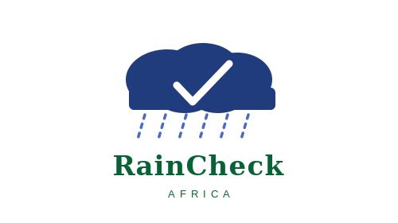

# RainCheck Africa

<p align="center">
	
</p>

**An interactive dashboard for exploring gridded rainfall product performance across Africa**

Built by [AfriClimate AI](https://africlimate.ai) · Data from a PRISMA-compliant systematic review and meta-analysis of 71 peer-reviewed validation studies

---

## Overview

Selecting the right rainfall dataset for African applications is non-trivial. No single product performs best everywhere — accuracy varies substantially by region, terrain, temporal scale, and application domain. RainCheck Africa makes the evidence base navigable.

The dashboard surfaces curated validation metrics extracted from 71 peer-reviewed studies published between 2015 and 2025, covering products evaluated against rain gauge networks across the continent. Users can filter by country, product, metric, temporal scale, and application type, and explore performance summaries alongside the underlying study-level data.

The underlying dataset is the companion data release to:

> **Performance of Gridded Rainfall Datasets in Africa: A Systematic Review and Synthesis**  
> *submitted to Water Resources Research*  
> [DOI — to be added on publication]

---

## Key findings

The systematic review underpinning this dashboard draws the following headline conclusions:

- **TAMSAT v3.1 and GPM IMERG** are the strongest-performing products at daily timescales across the reviewed literature. TAMSAT excels in East Africa and long-record climatological applications; IMERG shows broader continental coverage and strong detection skill for heavy events.
- **CHIRPS** remains the most reliable choice for drought monitoring, agricultural onset/cessation detection, and data-sparse basin applications, owing to its gauge-informed calibration and long record from 1981.
- **Reanalysis products** (ERA5, MERRA-2, WFDEI variants) are consistently outperformed by satellite-based and merged products for rainfall estimation across Africa and should be used with caution, particularly in mountainous regions and at daily timescales.
- **Performance degrades at daily timescales** across virtually all products — most overestimate light rainfall and underestimate heavy events. Monthly and seasonal aggregates show markedly stronger agreement with gauge observations.
- **ENACTS**, where implemented (28 countries), outperforms all global products by integrating quality-controlled national station data at 4 km resolution.
- **Mountainous and tropical regions** (Ethiopian Highlands, Central Africa, coastal West Africa) present persistent challenges for all products.

Full findings, subgroup analyses, and application-specific recommendations are available in the manuscript and the associated Zenodo data deposit.

---

## Data

The dashboard is powered by a structured extraction database compiled from the 71 studies in the review. Each record captures:

| Field | Description |
|---|---|
| `PAPER_ID` | Study identifier |
| `YEAR` | Publication year |
| `COUNTRY` | Country or sub-national region evaluated |
| `PRODUCT` / `PRODUCT_PARENT` | Rainfall product and product family |
| `PRODUCT_TYPE` | Satellite, reanalysis, merged, or gauge-based |
| `METRIC` | Validation metric (CC, RMSE, NSE, Bias, KGE, POD, FAR, CSI, etc.) |
| `VALUE` | Reported metric value |
| `TIME_SCALE` | 15 Minutes, Hourly, Daily, Pentadal, Dekadal|

The full dataset is deposited at Zenodo: [DOI — to be added]

---

## Products covered

The dashboard includes evaluation data for the following product families:

`CHIRPS` · `TAMSAT` · `IMERG` · `TRMM` · `CMORPH` · `PERSIANN` · `RFE` · `ARC` · `MSWEP` · `GSMaP` · `ERA5` · `MERRA` · `SM2RAIN` · `ENACTS` · `MSG` · and others


---

## Citation

If you use this dashboard or the underlying dataset in your research, please cite:

```
[Author list] (in review). Performance of Gridded Rainfall Datasets in Africa:
A Systematic Review and Synthesis. Water Resources Research.
```

---

## Contributing

We welcome contributions — particularly additional validation studies for products or regions not yet well represented in the database. Please open an issue or submit a pull request. See `CONTRIBUTING.md` for guidelines.

---

## Licence

Code: MIT  
Data: CC BY 4.0

---

## Contact

AfriClimate AI · [research@africlimate.ai](mailto:research@africlimate.ai) · [africlimate.ai](https://africlimate.ai)